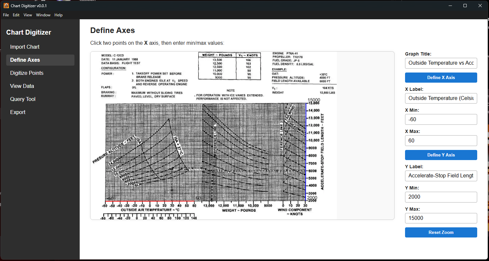
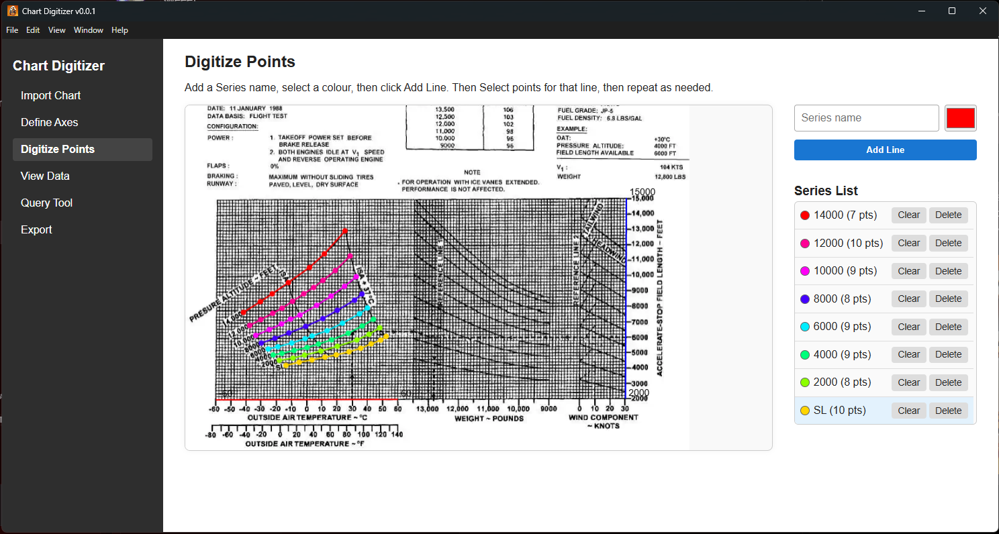
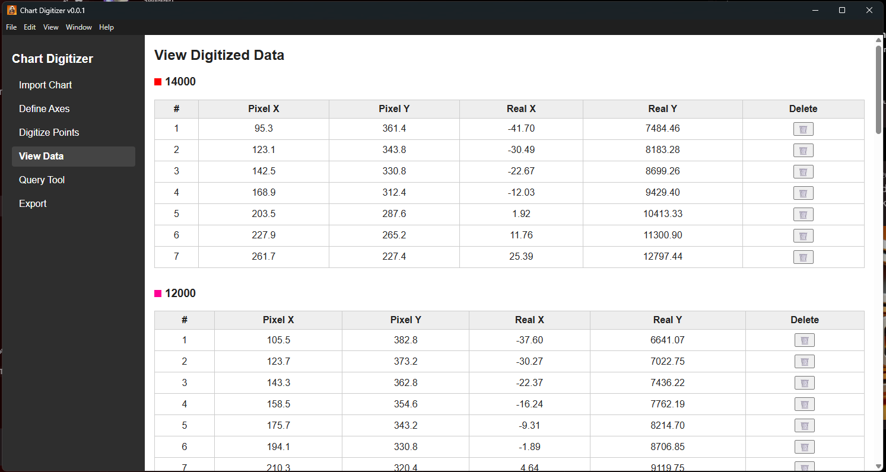
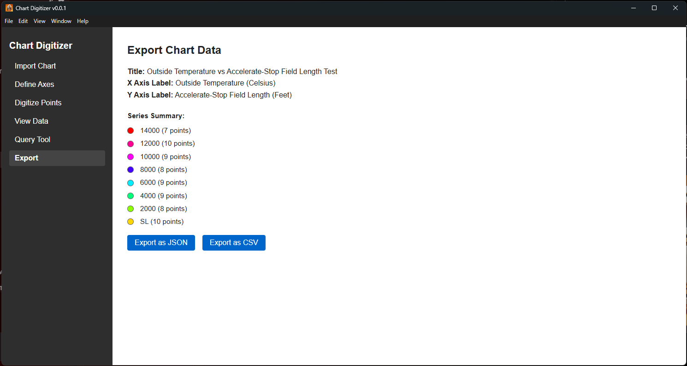
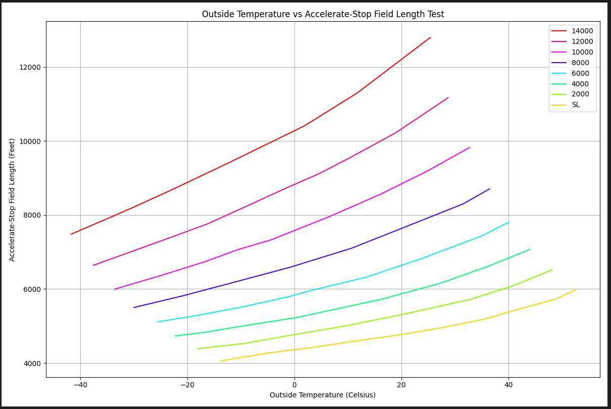

# Chart Digitizer

## Install Instructions

- Download the latest release installer from releases, and run the `.exe`.
- This will create a desktop shortcut for the app, and install it onto your system

## Build from source

- Clone the repository
- make sure you have node.js installed
- run `npm i` to install the required packages
- test with `npm run dev`
- to package, run `npm run build` then `npm run package` and your installer file will be in the `dist` folder

---

## Usage Instructions
### Step 1:
Import your chart

### Step 2:

Define your Axes, and Set Titles and labels

### Step 3:

Enter a series name, set a colour, then add the line.  
Next, define all your points for the series, then repeat for a new series

### Step 4:

If needed, you can inspect specific points. *note this is still WIP*

### Step 5:

Query tool is WIP

### Step 6:

Export your data, in either CSV or JSON, there is an included python script to convert the JSON to a Matplotlib chart

### Matplotlib Script:

Here is a sample output from the test chart used in development

